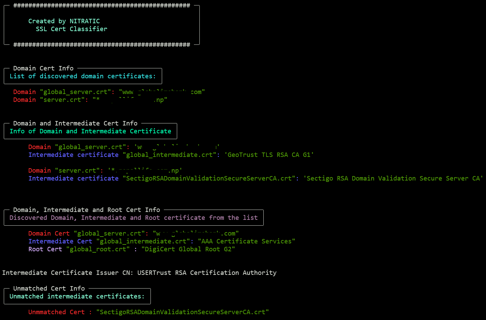

# ssl-cert-classifier
A Python tool to classify SSL certificates into Domain, Intermediate, and Root categories.


The project currently supports the classification of SSL certificates with a single intermediate certificate per domain. However, the script may break if the domain's subject starts with a subdomain (e.g., **online.nitratic.com**) or when multiple intermediate certificate issuers are present for a single domain.

<br>

**"All under-development code resides in the dev directory."**
<br>


## Features
- Classify Certificates: Identify and categorize SSL certificates.
- Domain Focus: Supports classification for one domain.
<br>



<br>

## Planned Enhancements
- **GUI Integration**: Upload certificates via a user-friendly interface.
- **Multi-Domain Support**: Classify certificates for multiple domains, including subdomains, by accepting the user-provided subdomain field during script execution.
- **Dockerized Deployment**: Simplify setup and execution.
- **F5 BIG-IP Integration**: Seamlessly integrate classification results with F5 BIG-IP.

<br>

## How to Use
Clone the repository
```
git clone https://github.com/yourusername/ssl-cert-classifier.git
cd ssl-cert-classifier
```

Store the SSL certificates and keys in the ssl directory or specify a directory name within the current working directory where the script is executed.

Run the script using one of the following commands:<br>
`python3 cert-classify.py`

or

`python3 cert-classify.py <directory-name>`

**Note: The specified directory must reside in the current working directory.**

<br>


# Future Goals
- Expand compatibility with additional certificate formats.
- Implement automated F5 BIG-IP certificate object and SSL profile generation.

<br>

**Contributions and suggestions are welcome!**
