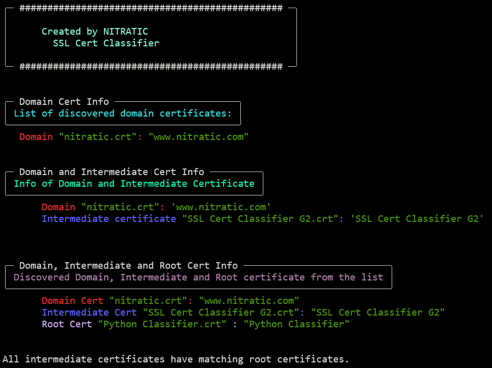

# ssl-cert-classifier
A Python tool to classify SSL certificates into Domain, Intermediate, and Root categories.

Currently supports classification for a single domain.

## Features
- Classify Certificates: Identify and categorize SSL certificates.
- Domain Focus: Supports classification for one domain.




## Planned Enhancements
- **GUI Integration**: Upload certificates via a user-friendly interface.
- **Multi-Domain Support**: Classify certificates for multiple domains.
- **Dockerized Deployment**: Simplify setup and execution.
- **F5 BIG-IP Integration**: Seamlessly integrate classification results with F5 BIG-IP.

## Usage
Clone the repository
```
git clone https://github.com/yourusername/ssl-cert-classifier.git
cd ssl-cert-classifier

```

Run the Python Script
`python3 cert-classify.py`


# Future Goals
- Expand compatibility with additional certificate formats.
- Implement automated F5 BIG-IP SSL profile generation.


**Contributions and suggestions are welcome!**
